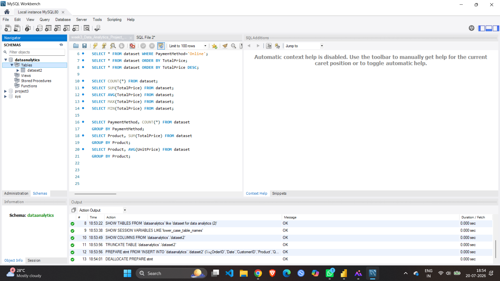

# E-Commerce Sales Data Analysis

## Project Overview
This project analyzes an e-commerce sales dataset using Excel, MySQL, and Power BI to identify sales trends and customer behavior.

## Tools Used
- Excel
- MySQL
- Power BI
- GitHub

## Project Steps
- Data Cleaning
- SQL Analysis
- Power BI Dashboard
- Business Insights

## Dashboard Includes
- KPI Cards
- Bar Chart
- Pie Chart
- Column Chart
- Slicers

## Screenshots
.png)

## Key Insights
- Analyzed customer orders and sales.
- Compared payment methods and order status.
- Identified top products and referral sources.
- Created an interactive dashboard for business analysis.

## Conclusion
This project demonstrates data cleaning, SQL querying, and dashboard creation to support data-driven decision-making.
